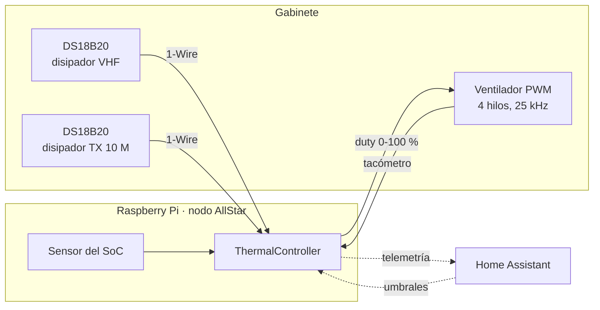

# gabinete-fan

Control térmico para el gabinete de un nodo AllStarLink en torre. Dos sensores
DS18B20 en los disipadores de los radios, leídos por la Raspberry Pi, que maneja
un ventilador PWM de 4 hilos y reporta a Home Assistant por MQTT.

Nació para resolver un problema concreto: el controlador de temperatura
comercial apagaba el ventilador **cortándole la corriente** al bajar de 39 °C, y
el calor que el transmisor seguía radiando quedaba atrapado dentro. Medido en la
Pi de este gabinete, eso ya le había costado rendimiento — `vcgencmd
get_throttled` reportaba el límite térmico y el SoC había bajado su reloj de
1.4 a 1.2 GHz.



Si se cae el túnel, el broker o Home Assistant, **la Pi sigue controlando el
ventilador**: la lógica es local y MQTT es solo telemetría y ajuste remoto.

## Qué hace distinto

- **Dos puntos de medición.** Arranca si *cualquiera* de los dos radios se
  calienta, no solo donde estaba la sonda única del controlador viejo.
- **Purga.** Al bajar del umbral de paro, el ventilador sigue a máximas
  revoluciones un tiempo configurable antes de detenerse, para barrer el calor
  residual en vez de encerrarlo.
- **Piso por temperatura de CPU.** Si la Raspberry se calienta, el ventilador
  arranca aunque los radios estén fríos. En la torre el gabinete se calienta
  desde afuera: medido con sol y sin tráfico, los radios se quedaron en 34 °C
  mientras la CPU subía a 57.5 °C — más caliente que su propio pico durante una
  net de 67 minutos de transmisión.
- **El estado seguro es soplando, no apagado.** Un ventilador de 4 hilos sin
  nadie manejando su PWM se va al 100 % por su propio pull-up, y todo el diseño
  se apoya en eso.
- **Alarma de ventilador trabado**, que importa cuando el equipo está en una
  torre y el acceso físico es caro.
- **Todo ajustable desde Home Assistant** sin reiniciar y sin tocar el
  `configuration.yaml`.

## Instalación

```bash
git clone https://github.com/xe2mbe/gabinete-fan.git
cd gabinete-fan
sudo ./install.sh
sudo reboot
sudo PYTHONPATH=/opt/gabinete-fan/src python3 -m gabinete_fan --discover
sudo systemctl start gabinete-fan
```

La guía completa —identificar los sensores, medir la curva del ventilador,
calibrar los umbrales y qué hacer cuando algo no sale— está en
**[docs/instalacion.md](docs/instalacion.md)**.

## Documentación

| | |
|---|---|
| **[docs/instalacion.md](docs/instalacion.md)** | Puesta en marcha paso a paso, actualización y solución de problemas |
| **[docs/arquitectura.md](docs/arquitectura.md)** | Diagramas: máquina de estados, piso de CPU, lazo de control, telemetría |
| **[docs/hardware.md](docs/hardware.md)** | Cableado, pines, RF, curva medida del ventilador y modos de falla |
| **[extras/](extras/)** | Las cuatro piezas que rodean al control térmico: túnel, anuncios por radio, salud del nodo y calidad del enlace. Empieza por aquí para ver cómo encajan |

## Comandos

| Comando | Para qué |
|---|---|
| `--discover` | Lista los DS18B20 detectados en el bus 1-Wire |
| `--fan-test` | Barre el duty midiendo RPM; de aquí salen `min_duty` y `stall_rpm` |
| `--fan-duty PCT` | Fija un duty y lo sostiene reportando RPM, para medir con multímetro |
| `--selftest` | Recorre un perfil de temperatura y muestra la línea de tiempo. No toca hardware |
| `--dry-run` | Corre con sensores reales pero sin escribir ningún GPIO |
| `--no-mqtt` | Sin Home Assistant; registra en consola |
| `--simulate-temps 44:47` | Temperaturas falsas para verificar Home Assistant. Acepta una lista que recorre en ciclo |

## Home Assistant

Todo se anuncia por MQTT discovery. Aparece un dispositivo **Gabinete ASL** con:

- **Sensores** — temperatura de cada radio y de la CPU, duty y RPM del
  ventilador, purga restante, estado y motivo. Si hay nodos AllStarLink
  configurados, también el tiempo de transmisión y el ciclo de trabajo de cada
  radio, que sirven para normalizar comparaciones térmicas entre días.
- **Alarmas** — «Falla de sensor», «Ventilador trabado» y «Control desde la Pi».
- **Salud del SoC** — la palabra de `vcgencmd get_throttled` desglosada en sus
  cuatro causas: bajo voltaje, frecuencia limitada, frenado y límite térmico,
  cada una como estado actual y como histórico, más la palabra cruda. Los
  históricos **no se apagan hasta reiniciar la Pi**: son cicatrices, no alarmas
  activas. También el voltaje del núcleo y el reloj del ARM — este último sube y
  baja solo con el gobernador `ondemand`, entre 600 y 1400 MHz, así que verlo
  bajo en reposo es normal y no indica throttling.
- **Ajustes** — umbrales de arranque, crítico y paro de los radios, arranque y
  paro por CPU, histéresis, tiempo de purga y duty manual.
- **Modo** — `auto`, `manual`, o `respaldo`.

Los cambios se validan (siempre `t_off < t_on < t_critical` y
`t_cpu_off < t_cpu`) y se persisten en `/var/lib/gabinete-fan/state.json`.

## Pruebas

```bash
python3 -m pytest tests/ -q
```

44 pruebas sobre la máquina de estados, el piso por temperatura de CPU, la
validación de parámetros, la ventana del watchdog y la alarma de ventilador
trabado. **No requieren Raspberry Pi**: `controller.py` y el detector de trabado
son lógica pura, sin E/S, exactamente para poder ejercitarlos sin hardware.

## Licencia

MIT — ver [LICENSE](LICENSE).

---

Escrito para el nodo 299084 de **XE2MBE**. Si lo adaptas a tu gabinete, lo único
que de verdad tienes que volver a medir es la curva de tu ventilador: dos
modelos casi idénticos pueden comportarse completamente distinto.
