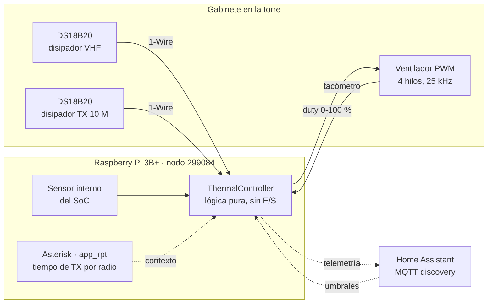
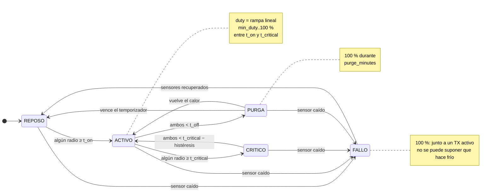
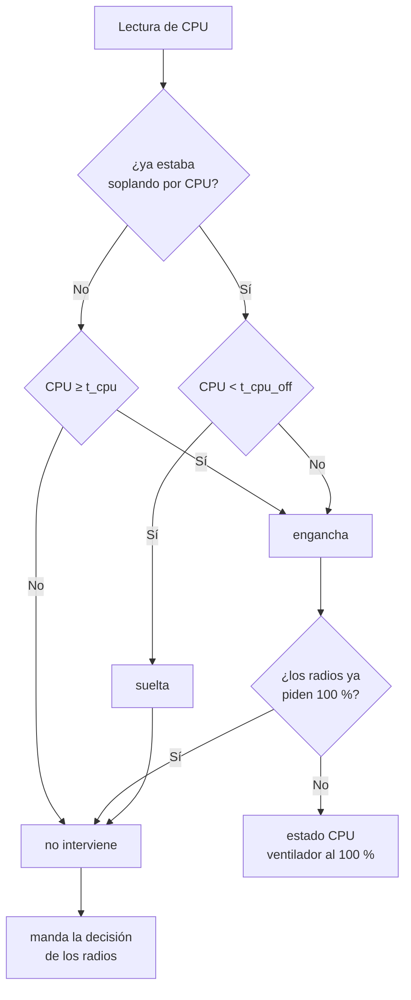
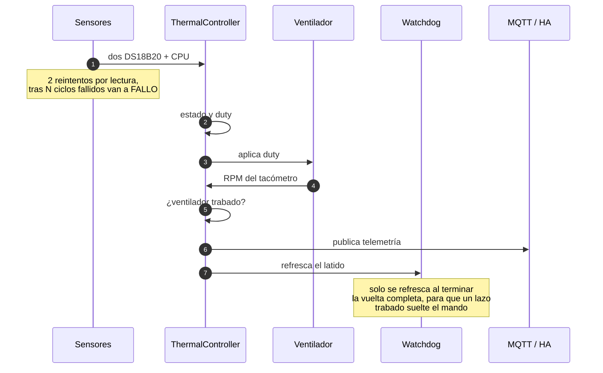
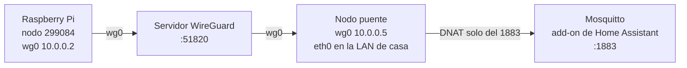
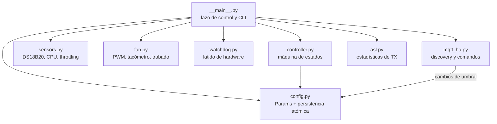

# Arquitectura

Cómo está armado `gabinete-fan` por dentro: qué mide, qué decide y por dónde
sale la telemetría.

---

## 1. Vista general

Tres sensores entran, un ventilador sale, y todo lo demás es telemetría.

La línea punteada es lo que **no** es crítico: si Home Assistant, el broker o el
túnel se caen, la lógica sigue corriendo en la Pi. MQTT es solo telemetría y
ajuste remoto.

---

## 2. La máquina de estados

Decide el duty a partir de las dos temperaturas de los radios.

**La purga es el punto del diseño.** El controlador original apagaba el
ventilador al bajar del umbral, y el calor que el TX seguía radiando quedaba
atrapado y calentaba la Pi. Antes de detenerse, el ventilador barre ese calor
residual a máximas revoluciones.

---

## 3. El piso por temperatura de CPU

Encima de la máquina de estados hay una segunda razón para soplar, y es
independiente de los radios.

Existe porque **en la torre el gabinete se calienta desde afuera**. Medido el 30
de agosto de 2026: con sol y sin un solo keyup, los radios se quedaron en 34 °C
—veinte grados por debajo de `t_on`— mientras la CPU subió a 57.5 °C, más
caliente que su propio pico durante una net de 67 minutos de transmisión.
Mirando solo los radios, el ventilador nunca habría arrancado.

Tres decisiones de diseño:

- **Es un piso, no un control paralelo.** Solo puede pedir *más* aire del que ya
  pidieron los radios, nunca menos. La máquina de estados corre igual por
  debajo, con sus temporizadores intactos; lo único que cambia es la etiqueta.
- **Va al 100 %, no por rampa.** Del umbral a los 60 °C del límite térmico del
  SoC quedan cinco grados, y a esa distancia no hay nada que dosificar. Además
  la curva medida del ventilador tiene zona muerta: a 40 % da 1800 RPM contra un
  piso de 1725, así que los duties intermedios casi no mueven aire.
- **`t_cpu_off` es umbral propio**, no `t_cpu` menos la histéresis de los
  radios, que es otra cosa. Cuidado con pegarlos: la CPU se lee en escalones de
  ~0.5 °C, y medido sobre la traza real, parar en 54 en vez de 53 no ahorra
  tiempo encendido (41 % contra 42 %) y sí mete ciclos de minuto y medio. Para
  que el ventilador corra menos, **sube `t_cpu`**: con arranque en 56 °C baja al
  35 % del tiempo, y en 57 °C al 21 %.

El modo `manual` manda sobre todo esto: es intención explícita del operador.

---

## 4. Una vuelta del lazo

Lo que pasa cada `poll_seconds` (5 s por omisión).

El orden importa. El latido del watchdog se refresca **al final**, de modo que
un lazo que se cuelgue a medio camino deja de latir y entrega el ventilador.

---

## 5. Por dónde llega la telemetría

El nodo está detrás de un enlace sin port forwarding y Home Assistant vive en
otra LAN, sin cliente WireGuard. Un tercer nodo hace de puente.

El nodo puente reenvía **únicamente el puerto 1883** desde el túnel hacia el
broker, con reglas `PostUp` en su `wg0.conf`, así que sobreviven a los
reinicios. Por eso `mqtt.host` apunta al nodo puente y no a la IP real de Home
Assistant.

Ese puente se reinicia por cron una vez por semana: la telemetría se corta un
minuto y Home Assistant marca el dispositivo como no disponible. **El ventilador
no se entera.**

---

## 6. Los módulos

`controller.py` y el detector de ventilador trabado de `fan.py` **no tocan
hardware a propósito**: son lógica pura, y por eso las 44 pruebas corren en
cualquier máquina sin Raspberry Pi.

---

## 7. Comportamiento ante fallas

Un ventilador de 4 hilos sin nadie manejando su pin de PWM se va al **100 %** por
su propio pull-up interno. Todo el diseño se apoya en eso: **el estado seguro no
es apagado, es soplando.** En una torre eso es exactamente lo que se quiere.

| Falla | Qué hace el ventilador |
|---|---|
| Un DS18B20 deja de responder | 100 %, estado `fallo`, alerta en HA |
| La CPU se calienta sin tráfico | 100 % por el piso de CPU |
| Se cae el túnel, HA o el broker | Nada: la lógica es local |
| Excepción en el servicio | 100 %, y systemd reinicia en 5 s |
| Paro limpio, reinicio o actualización | 100 % mientras dura el hueco |
| La Pi pierde corriente o no arranca | GPIO en alta impedancia → pull-up → 100 % |
| Kernel panic o cuelgue | El watchdog del SoC resetea en ≤60 s → 100 % |
| Se desconecta el cable de PWM | Pull-up → 100 % |
| SIGKILL | Último duty ~5 s, hasta que systemd reinicia |
| El ventilador se traba | Alarma «Ventilador trabado» en HA |

Por eso `Fan.close()` deja el PWM **habilitado al 100 %** en vez de apagarlo:
medido en la Pi 3B+, `enable=0` deja la línea en bajo, o sea el ventilador al
mínimo — justo lo que no se quiere sin nadie vigilando.

---

El cableado, la lista de materiales y la curva medida del ventilador están en
**[hardware.md](hardware.md)**. La puesta en marcha, en
**[instalacion.md](instalacion.md)**.
