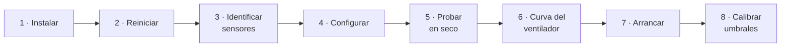

# Instalación

De cero a servicio corriendo. Toma unos 30 minutos más un reinicio.

El detalle del cableado está en **[hardware.md](hardware.md)**; aquí se asume
que los sensores y el ventilador ya están conectados.

---

## Antes de empezar

| Necesitas | Notas |
|---|---|
| Raspberry Pi con Debian 12 o 13 | Probado en 3B+ con Debian 13 trixie, aarch64 |
| Dos DS18B20 | En el mismo bus 1-Wire, alimentación de 3 hilos |
| Ventilador PWM de 4 hilos | Con tacómetro si quieres la alarma de trabado |
| Un broker MQTT | El add-on Mosquitto de Home Assistant sirve |
| Acceso `sudo` | El servicio corre como root: exportar un canal PWM lo exige |



---

## 1. Instalar

```bash
git clone https://github.com/xe2mbe/gabinete-fan.git
cd gabinete-fan
sudo ./install.sh
```

El instalador es **idempotente** — se puede volver a correr para actualizar el
código — y hace cuatro cosas:

- Instala las dependencias con `apt` (`python3-yaml`, `python3-paho-mqtt`,
  `python3-gpiozero`, `python3-lgpio`). En Debian 13 el entorno es
  *externally-managed* (PEP 668), así que **no** se usa `pip`.
- Copia el código a `/opt/gabinete-fan` y la configuración a
  `/etc/gabinete-fan/config.yaml`, con permisos `640` porque lleva la
  contraseña del broker. Si ya existe una configuración, **no la pisa**: deja la
  nueva como `config.yaml.nuevo`.
- Agrega los overlays de 1-Wire y PWM a `config.txt`, con respaldo previo.
- Instala y habilita el servicio de systemd, sin arrancarlo todavía.

> **Ojo en la Pi 3B+:** el audio analógico interno ocupa PWM0 y PWM1, el mismo
> hardware que necesita GPIO18. El instalador apaga `dtparam=audio=on` y avisa.
> Si tus nodos usan fobs USB (`rxchannel = SimpleUSB/...`), no afecta nada.

## 2. Reiniciar

Los overlays solo cargan al arranque.

```bash
sudo reboot
```

> Es un servidor de repetidor: hazlo en una ventana de baja actividad.

## 3. Identificar los sensores

```bash
sudo PYTHONPATH=/opt/gabinete-fan/src python3 -m gabinete_fan --discover
```

Salen los IDs de familia `28-…` presentes en el bus:

```
DS18B20 detectados en /sys/bus/w1/devices:
  28-3c01d607e65a
  28-000000c91978
```

**Para saber cuál es cuál, calienta uno a la vez** —con la mano basta— y mira
en `/sys/bus/w1/devices/28-…/w1_slave` cuál sube. Si los cables corren en el
mismo mazo es fácil agarrar el mismo dos veces: haz la prueba cruzada y confirma
que sube el otro.

> Un ID con tres bytes en cero, como `28-000000c91978`, es un **clon**. Lee
> bien, pero su tolerancia es de ±2 °C en vez de ±0.5. Si algún día marca
> corrido un par de grados, ya sabes por qué.

## 4. Configurar

```bash
sudo nano /etc/gabinete-fan/config.yaml
```

Lo mínimo que hay que tocar:

```yaml
mqtt:
  host: 10.0.0.5          # tu broker
  username: gabinete
  password: "LA_DE_VERDAD" # <-- cámbiala

sensors:
  vhf:
    id: "28-3c01d607e65a"  # <-- los tuyos, del paso 3
  tx10m:
    id: "28-000000c91978"

asl:
  nodes:
    vhf: 1001              # <-- tus números de nodo
    tx10m: 1002
```

Si no usas AllStarLink, borra la sección `asl:` completa y no pasa nada.

## 5. Probar en seco

Sin escribir un solo GPIO, con los sensores reales:

```bash
sudo PYTHONPATH=/opt/gabinete-fan/src python3 -m gabinete_fan --dry-run --no-mqtt
```

Deberías ver temperaturas plausibles y el estado `reposo`. `Ctrl-C` para salir.

Para validar la máquina de estados sin hardware ni sensores, recorriendo un
perfil de temperatura completo:

```bash
sudo PYTHONPATH=/opt/gabinete-fan/src python3 -m gabinete_fan --selftest
```

Y para verificar que Home Assistant recibe todo, antes de tener los sensores
puestos, con temperaturas falsas que recorren un ciclo:

```bash
sudo PYTHONPATH=/opt/gabinete-fan/src python3 -m gabinete_fan \
     --simulate-temps 30:31,44:47,52:48,36:35
```

## 6. La curva del ventilador

**Este paso no se salta.** Cada ventilador se comporta distinto, y de aquí salen
tres valores de la configuración.

```bash
sudo PYTHONPATH=/opt/gabinete-fan/src python3 -m gabinete_fan --fan-test
```

Barre el duty de 0 a 100 % y de regreso, midiendo RPM en cada paso, y al final
te dice qué poner en `config.yaml`. Hazlo **con el gabinete cerrado y armado
como va a quedar**, porque la contrapresión cambia la curva.

Tres cosas que responde y que no están en ninguna hoja de datos:

- **A qué duty empieza a responder de verdad** → `control.min_duty`. Muchos
  ventiladores ignoran el PWM por debajo de cierto punto y se quedan clavados en
  su piso; ahí la rampa no mueve ni un RPM.
- **Si se detiene con PWM en 0** o sigue girando. Si sigue, y quieres que se
  detenga, hace falta cortarle los +12 V con un MOSFET (`fan.power_gpio`).
- **Dónde poner la alarma de trabado** → `fan.stall_rpm`, muy por debajo del
  piso medido.

> Si algún día cambias de ventilador, **vuelve a correr `--fan-test`**. Dos
> modelos casi idénticos pueden tener curvas completamente distintas.

## 7. Arrancar

```bash
sudo systemctl start gabinete-fan
journalctl -u gabinete-fan -f
```

Una línea de resumen cada cinco minutos:

```
reposo    duty=  0.0%  rpm= 1732  vhf= 33.9  tx10m= 35.4  cpu= 50.5
          thr=0x0  tx[vhf=98.7min@4% tx10m=0.0min@0%] | reposo: 35.4 C
```

En Home Assistant aparece solo, por MQTT discovery, un dispositivo
**Gabinete ASL**. No hay que tocar el `configuration.yaml`.

## 8. Calibrar los umbrales

Los valores que trae son un punto de partida **tomado en interiores**. Los seis
umbrales se cambian desde Home Assistant sin reiniciar nada, se guardan en
`/var/lib/gabinete-fan/state.json` y el servicio rechaza combinaciones
inconsistentes (`t_off < t_on < t_critical` y `t_cpu_off < t_cpu`).

Deja correr un día completo y mira la gráfica. La medida de si funcionó **no es
la temperatura de los radios**: es la de la CPU, y que `vcgencmd get_throttled`
deje de reportar el límite térmico.

> Si el gabinete va a la intemperie, **estos números no van a valer**. Un
> gabinete metálico al sol puede rebasar por mucho la temperatura ambiente, y el
> ventilador solo puede acercar el interior al aire de afuera. Recalibra en
> sitio.

---

## Actualizar

```bash
cd gabinete-fan
git pull
sudo ./install.sh
sudo systemctl restart gabinete-fan
```

`install.sh` **no pisa** tu `/etc/gabinete-fan/config.yaml`. Si la versión nueva
trae parámetros que no tenías, toman su valor por omisión y no hay que hacer
nada; la versión nueva del archivo queda como `config.yaml.nuevo` por si quieres
comparar.

## Desinstalar

```bash
sudo systemctl disable --now gabinete-fan
sudo rm /etc/systemd/system/gabinete-fan.service
sudo systemctl daemon-reload
sudo rm -rf /opt/gabinete-fan /etc/gabinete-fan /var/lib/gabinete-fan
```

Los overlays que agregó el instalador siguen en `config.txt`; quítalos a mano si
quieres, o restaura el respaldo `config.txt.gabinete-bak`.

---

## Cuando algo no sale

| Síntoma | Qué revisar |
|---|---|
| `--discover` no encuentra nada | ¿`dtoverlay=w1-gpio,gpiopin=4` en `config.txt`? ¿Reiniciaste? ¿Resistencia de 4.7 kΩ a 3.3 V? |
| `no existe pwmchip0` | Falta `dtoverlay=pwm,pin=18,func=2`, o `dtparam=audio=on` sigue ocupando el PWM |
| Lecturas de 85.0 °C | Alimentación parásita o ruido de RF. El código ya las trata como fallo |
| «Falla de sensor» solo al transmitir | Es RF en el bus 1-Wire, no un sensor muerto. Ver la sección de RF en [hardware.md](hardware.md) |
| El ventilador gira errático | Las masas de la Pi y de la fuente de 12 V no están unidas en un punto |
| El ventilador no responde al duty | Zona muerta. Corre `--fan-test` y sube `min_duty` |
| No aparece en Home Assistant | ¿Llega al broker? `journalctl -u gabinete-fan | grep MQTT`. Revisa host, usuario y contraseña |
| `No se puede leer … hace falta sudo` | La configuración es `640` porque lleva la contraseña. Corre con `sudo` |

Para ver la palabra de throttling desglosada —bajo voltaje, frenado, límite
térmico, cada uno como estado actual e histórico— mira las entidades de
diagnóstico en Home Assistant. Los históricos **no se apagan hasta reiniciar la
Pi**: son cicatrices, no alarmas activas.

---

## Pruebas

```bash
python3 -m pytest tests/ -q
```

44 pruebas sobre la máquina de estados, el piso por temperatura de CPU, la
validación de parámetros, la ventana del watchdog y la alarma de ventilador
trabado. **No requieren Raspberry Pi** — la lógica es pura a propósito.
