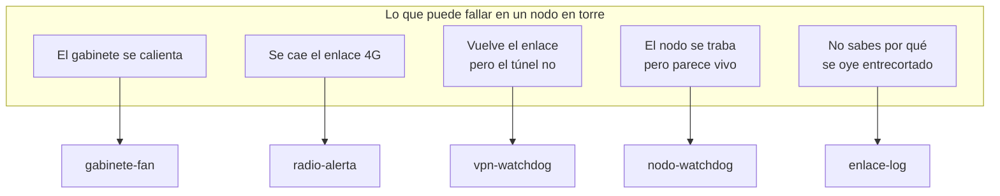

# extras — las piezas que rodean al control térmico

`gabinete-fan` controla el ventilador. Estas cuatro piezas cubren las otras
formas en que un nodo en torre te deja tirado, y **todas nacieron de una falla
real**, no de imaginar escenarios.

Son independientes: puedes instalar una, varias o ninguna.

## De qué te protege cada una



| Pieza | La falla que la originó | Qué hace |
|---|---|---|
| **[vpn-watchdog](vpn-watchdog/)** | Un corte de 4G dejó el nodo sin reportar **13 horas**, ya con internet de vuelta | Detecta que el túnel quedó mudo y lo levanta en menos de un minuto |
| **[radio-alerta](radio-alerta/)** | Sin internet no hay Home Assistant, ni MQTT, ni SSH: nadie se entera | Anuncia la falla **por el radio**, que es el único canal que sigue vivo |
| **[nodo-watchdog](nodo-watchdog/)** | La Pi se trabó **65 minutos** hasta que alguien subió a la torre | Verifica que Asterisk *conteste*, y escala hasta reiniciar la Pi |
| **[enlace-log](enlace-log/)** | El audio se oía entrecortado y no había forma de saber por qué | Registra pérdida y latencia por minuto, para cruzarlas contra el TX |

## El hilo común: fallar en silencio

Las cuatro existen porque **algo reportaba estar bien sin estarlo**:

- `wg-quick@wg0` es `oneshot`: systemd lo da por terminado al arrancar y nunca
  lo vuelve a mirar. Si el túnel muere, para systemd no pasó nada.
- `asterisk.service` decía `active` durante los 65 minutos de atasco. Y era
  cierto: el proceso existía. Simplemente no contestaba.
- El watchdog por hardware seguía alimentándose puntualmente, porque systemd
  estaba sano — solo estaban muertos los servicios.
- Desde afuera la Pi respondía pings y servía páginas.

Por eso ninguna de estas piezas pregunta *«¿está corriendo?»*. Preguntan
**«¿funciona?»**, con tráfico real y respuestas reales.

## Orden de instalación

No hay dependencias duras, pero este orden tiene sentido:

```bash
cd extras/enlace-log    && sudo ./install.sh   # 1. medir antes de opinar
cd ../vpn-watchdog      && sudo ./install.sh   # 2. que el túnel vuelva solo
cd ../radio-alerta      && sudo ./install.sh   # 3. avisar cuando no hay red
cd ../nodo-watchdog     && sudo ./install.sh   # 4. recuperar el nodo trabado
```

`radio-alerta` le da voz a `vpn-watchdog`; sin él, el vigilante funciona igual
pero en silencio. Los demás son independientes entre sí.

## Antes que nada: el journal persistente

**Hazlo primero.** En una Pi el journal suele vivir en RAM y se pierde en cada
reinicio — justo cuando más falta hace, que es para investigar por qué se
reinició. Sin esto, cada falla te deja adivinando:

```bash
sudo mkdir -p /etc/systemd/journald.conf.d
printf '[Journal]\nStorage=persistent\nSystemMaxUse=300M\n' | \
  sudo tee /etc/systemd/journald.conf.d/persistente.conf
sudo systemctl restart systemd-journald
sudo journalctl --flush          # <-- este paso es el que suele faltar
```

Y **verifícalo**, no lo supongas. Crear `/var/log/journal` no basta:

```bash
journalctl --header | grep "File path"
# debe decir /var/log/journal/... y no /run/log/journal/...
```

## Qué escribe cada una y dónde

| Dónde | Qué |
|---|---|
| `journalctl -t vpn-watchdog` | Solo cuando el túnel está caído |
| `journalctl -t radio-alerta` | Cada anuncio que sale al aire |
| `journalctl -t nodo-watchdog` | Solo cuando el nodo no contesta |
| `/var/lib/gabinete-fan/telemetria/tx-*.csv` | Temperaturas y TX, cada ~5 s |
| `/var/lib/gabinete-fan/telemetria/enlace-*.csv` | Pérdida y latencia, cada minuto |

**En operación normal los tres vigilantes no escriben nada.** Un journal vacío
es la señal de que todo va bien.

Los dos CSV comparten directorio a propósito: cruzarlos es lo que permite
distinguir si la pérdida de paquetes sigue al transmisor —RF entrando al
CPE—, a la hora del día —saturación de la celda— o a nada en particular
—cobertura—.

## Una lección que costó dos veces

`systemctl enable --now` arranca el servicio si estaba parado, pero **no lo
reinicia si ya corría**. Al actualizar el código, el proceso viejo sigue
ejecutándose desde su descriptor de archivo abierto, aunque el archivo ya no
exista en disco. El instalador reporta éxito, `systemd` dice `active`, y estás
corriendo la versión anterior.

Los cuatro instaladores hacen `enable` **y** `restart` por separado. Si escribes
uno propio, no lo olvides.
