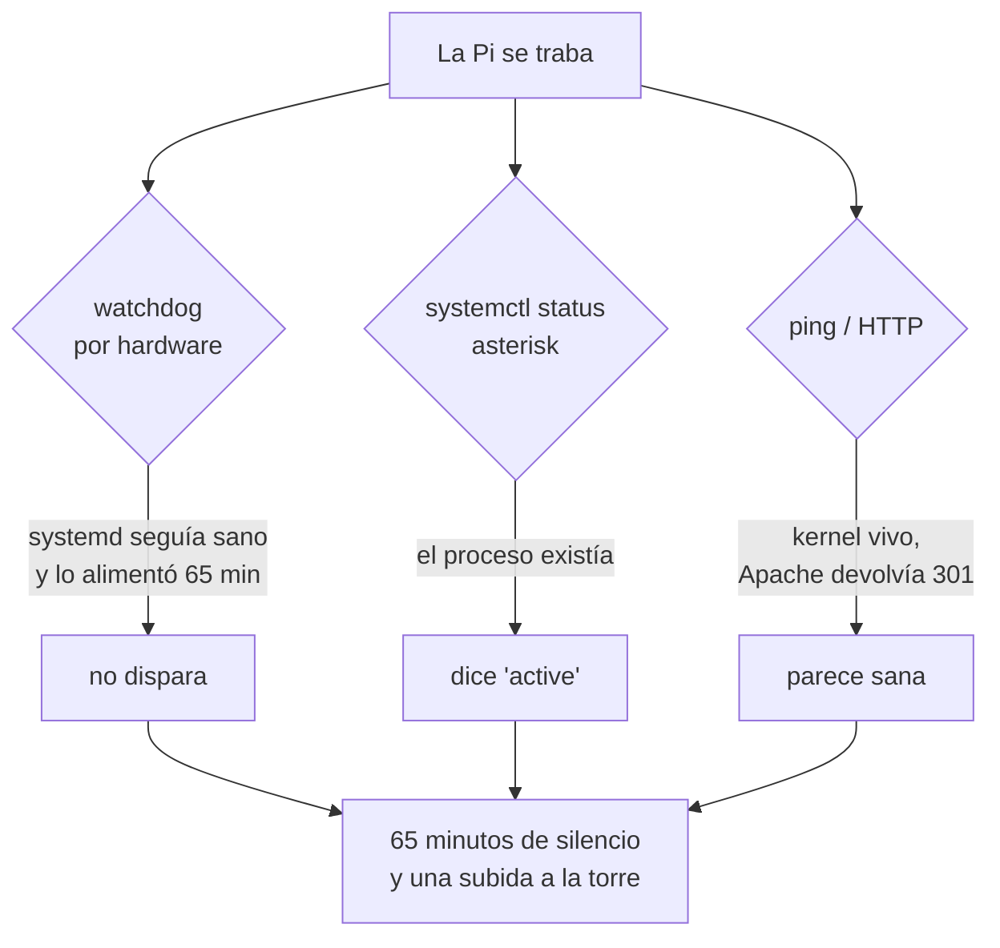

# nodo-watchdog

Vigila que el nodo esté **vivo**, no solo que sus procesos existan.

## El atasco que lo originó

El 2 de septiembre de 2026, a las **18:26:57**, en plena net, la Raspberry dejó
de responder. Estuvo **65 minutos muerta** hasta que alguien subió a la torre a
reiniciarla a mano.

El registro local de telemetría —lo único que sobrevivió— muestra el instante
exacto, y lo desconcertante del caso:

```
18:26:43  vhf 43.5  cpu 51.5  activo  duty 80.0  rpm 4012
18:26:50  vhf 43.6  cpu 52.1  activo  duty 80.8  rpm 4082
18:26:57  vhf 43.6  cpu 51.5  activo  duty 80.8  rpm 4149   <-- última fila
```

**Se colgó con todo en orden**: CPU a 51.5 °C, gabinete a 43.6 °C, ventilador
trabajando al 80 %, sin fallas de sensor. No fue calor, ni el ventilador, ni
falta de recursos.

El LED de actividad del fob USB del nodo 1001 no parpadeaba, y en arranques
anteriores ya habían aparecido avisos de `chan_simpleusb: Possibly stuck USB
read channel [1001]`. La sospecha firme es el fob colgado arrastrando a
Asterisk a espera de E/S ininterrumpible.

## Por qué nada de lo que había puesto lo detectó



Tres protecciones, y las tres con el mismo punto ciego:

- **El watchdog por hardware** (BCM2835, 60 s) estaba activo y systemd lo
  alimentaba cada minuto — y lo siguió alimentando los 65 minutos. systemd
  estaba perfectamente sano; solo estaban atascados Asterisk, PHP y sshd. Ese
  watchdog solo salva de un cuelgue **total** del kernel.
- **systemd** reportaba `asterisk.service` como `active`. Y lo estaba: el
  proceso existía. Simplemente no contestaba.
- **Desde afuera** la máquina parecía viva: respondía pings sin pérdida y
  Apache alcanzaba a devolver un 301.

Por eso este vigilante no pregunta *«¿está corriendo el proceso?»* sino
**«¿me contesta?»**.

## Qué hace

Cada minuto ejecuta `asterisk -rx "core show uptime"` **envuelto en un
timeout** — sin eso el vigilante se atascaría junto con el nodo.

| Revisiones sin respuesta | Acción |
|---:|---|
| 1 | Registra el contexto: fobs USB visibles, carga, procesos en espera de E/S |
| **3** (~3 min) | Reinicia `asterisk.service` |
| **8** (~8 min) | **Reinicia la Raspberry** |

El contexto se registra **antes** de intentar nada, porque el reinicio se lleva
la evidencia por delante.

### El reinicio viene activo, y por qué

Si los hilos de Asterisk quedan en espera ininterrumpible por un USB colgado,
**ni `SIGKILL` los mata**: reiniciar el servicio no sirve y el reinicio de la
máquina es la única salida. Eso fue exactamente lo que pasó, y por eso hizo
falta subir a la torre.

Para desactivarlo:

```bash
sudo systemctl edit nodo-watchdog.service
```

```ini
[Service]
Environment=REBOOT=0
```

### Guarda contra bucles

Si ya se reinició por esta causa hace menos de una hora, **no vuelve a
reiniciar**. Registra que la intervención no sirvió y se queda quieto:

```
NO se reinicia: ya se habia reiniciado hace 12 min y no sirvio.
El nodo necesita intervencion humana; revisa el fob USB y el cableado.
```

Sin esa guarda, una falla persistente dejaría al repetidor entrando y saliendo
del aire cada ocho minutos. Está probado con casos simulados: ante un nodo que
no se recupera con nada, ordena **exactamente un** reinicio.

## Instalación

```bash
cd extras/nodo-watchdog
sudo ./install.sh
```

## Verificar

```bash
systemctl list-timers nodo-watchdog.timer   # cuándo corre
sudo /usr/local/sbin/nodo-watchdog.sh       # probarlo a mano
journalctl -t nodo-watchdog --since today   # qué ha hecho
```

En operación normal **no escribe nada**. Un journal vacío es la señal de que
todo va bien.

## Antes de esto: el journal persistente

Cuando pasó el atasco, los mensajes del kernel sobre el USB se perdieron al
reiniciar, porque journald escribía en `/run` (RAM). Sin ellos no hay forma de
confirmar la causa.

```bash
sudo mkdir -p /etc/systemd/journald.conf.d
printf '[Journal]\nStorage=persistent\nSystemMaxUse=300M\n' | \
  sudo tee /etc/systemd/journald.conf.d/persistente.conf
sudo systemctl restart systemd-journald
sudo journalctl --flush          # <-- este paso es el que suele faltar
```

**Verifícalo, no lo supongas.** Crear `/var/log/journal` no basta, y
`Storage=persistent` tampoco migra por sí solo:

```bash
journalctl --header | grep "File path"
# debe decir /var/log/journal/... y no /run/log/journal/...
```
