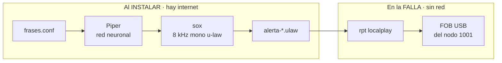

# radio-alerta

Anuncia por radio, en el nodo local, que el sitio perdió el enlace.

Cuando la Raspberry se queda sin internet no hay Home Assistant, no hay MQTT y
no hay SSH. **El radio es el único canal que sigue vivo**, y es el que se usa
para avisar qué está pasando.

## La restricción que define todo el diseño

El anuncio tiene que sonar **exactamente cuando no hay internet**. Eso descarta
cualquier síntesis de voz en la nube — incluido el pipeline con ElevenLabs de
[AllVox](https://github.com/xe2mbe/AllVox), que es la opción obvia y que fallaría
justo en el momento en que hace falta.

Pero la restricción aplica a **reproducir**, no a **generar**. Y esos son dos
momentos distintos:



Como la generación ocurre al instalar, **puede permitirse ser lenta y pesada**.
Por eso el motor es **Piper**: red neuronal, 61 MB de modelo, unos 11 segundos
por frase en una Pi 3B+. Nada de eso importa, porque corre una sola vez.

En la falla no se sintetiza nada: solo se abre un archivo que ya existe.

Si no hay modelo de Piper, el generador cae a `espeak-ng` y lo avisa. Funciona
igual, pero suena a robot.

## Qué anuncia

Cada anuncio va envuelto en un **tono de atención**: dos pares alternados de
1200 y 900 Hz al entrar, y un par descendente al salir. Los tonos se sintetizan
con `sox` —deterministas, sin API ni credenciales— y llevan un desvanecido de
8 ms en los bordes, que no es adorno: un seno que arranca y corta en seco
produce un chasquido que en RF se oye peor que el tono mismo.

Con tonos, un anuncio queda en unos 6 segundos. `TONO=0` los desactiva.

Tres frases, en `/etc/radio-alerta/frases.conf`:

| Clave | Cuándo |
|---|---|
| `sin_internet` | El enlace 4G está caído. No hay nada que reparar desde la Pi |
| `tunel_caido` | Hay internet pero el túnel no responde. Se está reintentando |
| `restablecido` | El enlace volvió |

El número de nodo se deletrea dígito por dígito a propósito: sobre RF, con ruido
y desvanecimiento, «dos nueve nueve cero ocho cuatro» se entiende mucho mejor
que «doscientos noventa y nueve mil ochenta y cuatro».

## Cómo evita acaparar el repetidor

Esto sale al aire por un repetidor que otras personas están usando. La política
va en el vigilante del túnel y está medida:

- **Espera a confirmar la falla.** Tres revisiones seguidas, o sea unos tres
  minutos, antes del primer aviso. Un parpadeo de treinta segundos no merece
  ocupar el repetidor.
- **Repite cada 15 minutos**, no cada minuto.
- **Se calla tras 12 avisos** —unas tres horas— aunque la falla siga. Si en tres
  horas nadie fue, no va a servir seguir gritando y el repetidor lo usan otros.
  Con `MAX_ANUNCIOS=0` avisa sin tope hasta que el enlace vuelva.
- **Solo anuncia la recuperación si llegó a anunciar la falla.** Si nadie la
  oyó, avisar que ya se arregló es ruido.
- Un cambio en la clase de falla reinicia el conteo: es otra falla y merece su
  propio aviso.

Todo eso está probado con casos simulados, incluido el tope y el parpadeo corto.

## `localplay`, no `playback`

El anuncio sale **solo por el transmisor de este nodo**, no hacia los nodos
enlazados. Durante un corte los enlaces están muertos de todos modos, y al
volver no tiene caso anunciarle la falla a media red.

## Instalación

```bash
cd extras/radio-alerta
sudo ./install.sh
```

Instala `sox` y `espeak-ng` si faltan, **descarga la voz de Piper** (61 MB,
desde HuggingFace, a `/usr/share/radio-alerta/voces/`), copia los scripts,
escribe las frases en `/etc/radio-alerta/frases.conf` y **genera los audios**.

Para saltarse la descarga y quedarse con la voz robótica:

```bash
sudo SIN_PIPER=1 ./install.sh
```

Si la descarga falla, el instalador avisa y sigue con `espeak-ng`; se puede
reintentar corriendo el instalador otra vez.

Requiere el [vigilante del túnel](../vpn-watchdog/) para dispararse solo; sin él
los scripts funcionan igual pero hay que llamarlos a mano.

## Probar

```bash
# sacarlo al aire por el nodo — esto transmite
sudo /usr/local/sbin/radio-alerta.sh sin_internet

# ver qué ha anunciado
journalctl -t radio-alerta --since today
```

El anuncio sale por **app_rpt** (`rpt localplay <nodo> <archivo>`) hacia el
canal del nodo, que es `SimpleUSB/1001` — el FOB conectado al radio.

> **No intentes oírlo con `play` en la Pi.** Eso usaría la tarjeta de sonido y
> no el radio, y de todos modos no funcionaría: el instalador del ventilador
> desactiva el audio analógico para liberar PWM0 y PWM1, que es el hardware que
> necesita el ventilador. Para escuchar un anuncio sin transmitir, copia el
> `.ulaw` a otra máquina.

## Cambiar los textos

```bash
sudo nano /etc/radio-alerta/frases.conf
sudo /usr/local/sbin/radio-alerta-generar.sh
```

Manten las frases **por debajo de ocho segundos**. El generador imprime la
duración de cada una para que sea fácil ajustarlas. Con Piper salen más cortas
que con espeak —no arrastra las sílabas— así que al cambiar de motor conviene
volver a mirarlas.

Si tu nodo no es el 1001, edita `NODO` en `/usr/local/sbin/radio-alerta.sh`.

## Ajustar la política

```bash
sudo systemctl edit vpn-watchdog.service
```

```ini
[Service]
Environment=ANUNCIAR_TRAS=3      # revisiones antes del primer aviso
Environment=REPETIR_CADA=15      # revisiones entre repeticiones
Environment=MAX_ANUNCIOS=12      # tope de avisos por episodio
Environment=ANUNCIAR=0           # apagar los anuncios sin desinstalar nada
```
