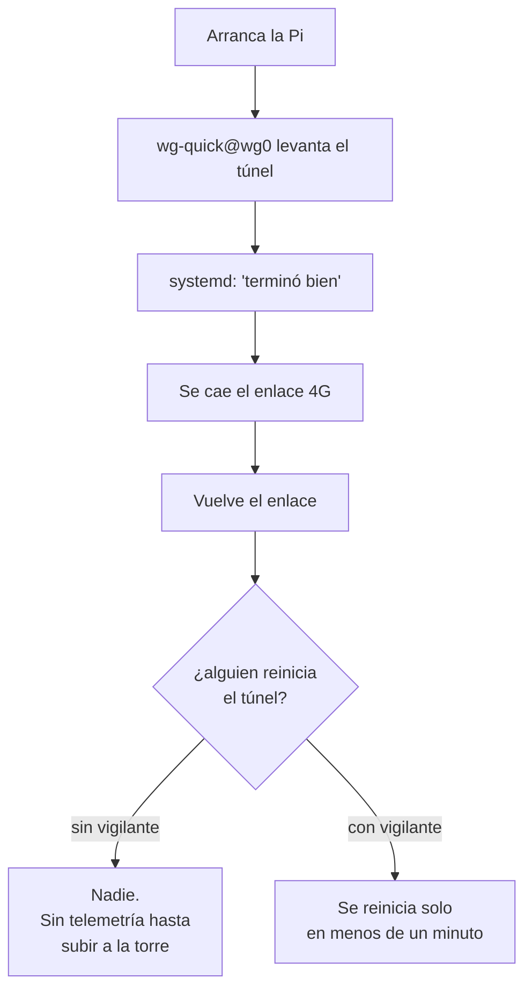

# vpn-watchdog

Vigilante del túnel WireGuard, para sitios donde la Raspberry depende de un
enlace que se cae — 4G en una torre, típicamente.

No tiene nada que ver con el control térmico. Está aquí porque resuelve el otro
modo de falla del mismo despliegue: **la telemetría deja de llegar a Home
Assistant y nadie se entera hasta que alguien sube a la torre.**

## El problema

`wg-quick@wg0` es un servicio **`oneshot`**. systemd lo ejecuta al arranque, el
script termina, y a partir de ahí systemd lo considera «activo» para siempre.
Nunca lo vuelve a tocar.



`Restart=on-failure` tampoco ayuda: el servicio **termina «bien»**, así que para
systemd nunca hubo una falla que reintentar.

### Y desde la Pi no se ve el corte

Este es el detalle que hace el problema difícil de diagnosticar. La Pi no habla
4G: se conecta **por Ethernet a un router 4G**. Cuando el operador pierde el
servicio, **el cable sigue arriba**.

```
eth0    UP    192.168.192.2/24
default via 192.168.192.1 dev eth0 proto dhcp
```

La interfaz sigue activa, la IP sigue asignada, la ruta por omisión sigue ahí.
Desde adentro **todo se ve perfectamente sano** mientras la Pi está del todo
aislada. Ningún servicio del sistema se entera, y por eso hace falta preguntarle
a algo que sí esté del otro lado.

> Un aviso al leer los registros después de un corte: la Raspberry Pi **no tiene
> reloj de batería**. Si arranca sin internet parte de una hora vieja, y el
> journal muestra el arranque de madrugada aunque haya sido por la tarde, con un
> salto de horas a media bitácora cuando NTP por fin alcanza un servidor. No es
> un fallo — pero persigues fantasmas si no lo sabes.

## Cómo lo resuelve

Un temporizador dispara cada minuto un script que decide en tres pasos:

1. **¿Hay internet?** Si no, no hace nada. Reiniciar el túnel sin enlace solo
   genera ruido; se espera al siguiente disparo.
2. **¿Responde el otro extremo por el túnel?** Se comprueba con tráfico real
   (`ping -I wg0`), **no** con la edad del handshake: WireGuard no renueva el
   handshake si no hay nada que mandar, así que un handshake viejo en un túnel
   ocioso es perfectamente normal y no es motivo para reiniciar nada.
3. **Hay internet pero el túnel está mudo** → registra hace cuánto y reinicia
   `wg-quick@wg0`. Diez segundos después confirma si volvió, y lo deja anotado.

Todo queda en el journal bajo la etiqueta `vpn-watchdog`, para poder
reconstruir después qué pasó.

## Instalación

```bash
cd extras/vpn-watchdog
sudo ./install.sh
```

Si tu túnel no se llama `wg0` o el otro extremo no es `10.10.0.1`, edita las
variables al inicio de `/usr/local/sbin/vpn-watchdog.sh`.

## Verificar

```bash
systemctl list-timers vpn-watchdog.timer     # cuándo corre
sudo /usr/local/sbin/vpn-watchdog.sh         # probarlo a mano
journalctl -t vpn-watchdog --since today     # qué ha hecho
```

En operación normal **no escribe nada**: solo habla cuando encuentra el túnel
caído. Un journal vacío es la señal de que todo va bien.

## Por qué `PersistentKeepalive` no basta

Es lo primero que uno revisa, y hay que tenerlo:

```ini
[Peer]
...
Endpoint            = 203.0.113.10:51820   # IP fija, no un nombre
PersistentKeepalive = 25
```

El keepalive mantiene viva la traducción de NAT de la operadora, y el endpoint
por IP evita que un DNS fallido al arranque deje al peer sin destino para
siempre — `wg-quick` resuelve el nombre **una sola vez**.

Pero con las dos cosas bien puestas el túnel puede no volver igual, y así fue
como se descubrió: **tras un corte largo WireGuard deja de reintentar el
handshake.** Sigue mandando keepalives mientras hay sesión, pero cuando la
sesión se pierde y los intentos fallan el tiempo suficiente, el peer se queda
callado esperando tráfico nuevo. Si además nada del lado de la Pi genera ese
tráfico con la insistencia necesaria, el túnel puede quedarse mudo por horas.

Ahí es donde entra el vigilante: él sí insiste.

### Journal persistente

En una Pi el journal suele ser volátil: **al reiniciar se pierde todo**. En un
sitio remoto eso significa llegar a diagnosticar sin evidencia de lo que pasó.

```bash
sudo mkdir -p /var/log/journal
sudo systemd-tmpfiles --create --prefix /var/log/journal
sudo systemctl restart systemd-journald
```

Cuesta unos cientos de megas y vale cada uno.

## Reinicio como último recurso

Viene **apagado**. Si tras `MAX_INTENTOS` reparaciones seguidas el túnel no
vuelve, el vigilante puede reiniciar la Pi:

```bash
sudo systemctl edit vpn-watchdog.service
```

```ini
[Service]
Environment=REINICIAR_SI_FALLA=1
Environment=MAX_INTENTOS=10
```

Con el temporizador cada minuto, eso son diez minutos de intentos antes de
reiniciar. Piénsalo dos veces en un nodo de repetidor: un reinicio lo saca del
aire, y por eso la decisión es del operador y no del script.
